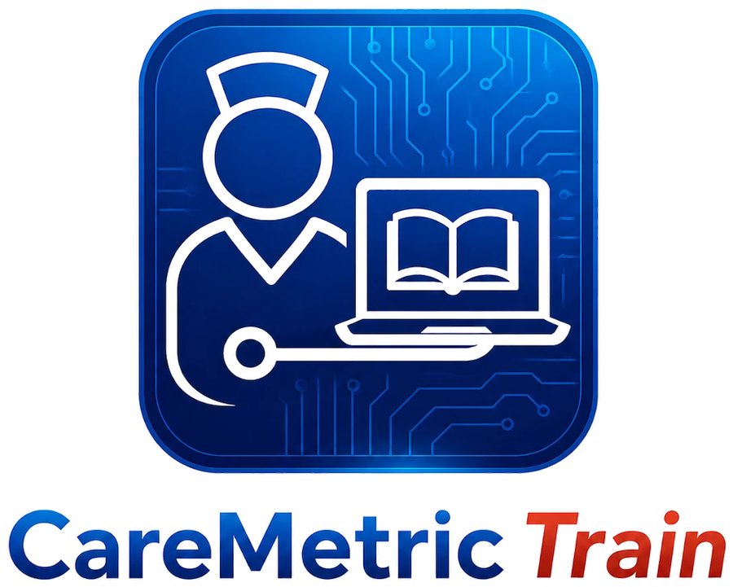

<p align="center">
  
</p>

# CareMetric Train

**[CareMetricTrain.com](https://caremetrictrain.com)**

CareMetric Train is a multi-tenant healthcare compliance-training and LMS platform for personal care homes,
assisted living facilities, and related healthcare organizations. It is built directly on Supabase: Postgres with
Row-Level Security, Supabase Auth, Supabase Storage, and Edge Functions. There is no separate API server -- the
React frontend talks to Supabase directly via `supabase-js`.

**Production**: https://caremetrictrain.com (Railway-hosted, service domain
`penntrain-production.up.railway.app`; see `DEPLOYMENT.md`).

## Implementation roadmap

The canonical program plan for the 29 approved improvements is
[IMPLEMENTATION_PLAN.md](IMPLEMENTATION_PLAN.md). It defines five
dependency-aware phases, delivery gates, migration and rollout rules, and the
complete recommendation-to-phase crosswalk. Multilingual experience is
explicitly excluded from that program.

ROADMAP.md remains the historical product review and recommendation rationale.

## What's included

- Six-role RBAC (`platform_admin`, `org_admin`, `facility_manager`, `trainer`, `employee`, `auditor`) enforced by
  Postgres Row-Level Security, not application code.
- Core compliance tracking: organizations, facilities, employees, configurable training types, training records,
  medication practicums, live training classes, document uploads (Supabase Storage, signed URLs), alerts, audit
  logs, and a report center.
- A full LMS layer: course/version/block authoring, quizzes with server-side grading, course assignments and
  progress tracking, certificates (with a public `/verify/:slug` verification route), training plans, and
  competency checklist templates/records.
- A real, generated Compliance Binder PDF (`generate-compliance-binder` Edge Function using `pdf-lib`), replacing
  the earlier print-to-PDF mock.
- Admin user provisioning, role/org management, and bulk CSV employee import, all via Edge Functions running with
  the service-role key behind an authorization check on the caller's own role.
- A platform_admin-only "Viewing as Org X" UX filter for the admin console -- a convenience, not a security
  boundary, since `is_platform_admin()` already grants unrestricted RLS access.

## Run locally

The preferred local environment is the checked-in dev container, which pins Node 24.15.x, pnpm 10.28.x, Deno 2.x,
the Supabase CLI, and OS packages used by the app/test workflow. Open the repo in VS Code or GitHub Codespaces and
choose **Reopen in Container**; the container runs `pnpm install --frozen-lockfile` and `pnpm run doctor` after it is
created.

```bash
pnpm install
pnpm --filter @workspace/caremetric-train dev
```

Copy `artifacts/caremetric-train/.env.example` to `.env` and fill in your Supabase project URL, publishable
(anon) key, and Cloudflare Turnstile site key. The workspace installs native optional dependencies for the current
developer machine plus linux-x64-glibc CI/deploys via pnpm `supportedArchitectures`.

Useful validation commands inside the dev container:

```bash
pnpm run typecheck
pnpm run test
pnpm run check:edge-functions
pnpm run check:all
pnpm run check:release
```

`check:release` is the local Phase 1 clean-room gate. It starts the pinned
Supabase stack, reapplies every migration, runs pgTAP, linting and advisors,
checks generated type drift, and verifies the application artifact. Docker is
required. CI additionally runs the disposable role, public-verification,
guest, and accessibility journeys in Chromium.

For production deployment (Railway + Supabase), see `DEPLOYMENT.md`.
Phase 1 rollout, recovery, ownership, and pilot procedures are in
[`PHASE1_OPERATIONS.md`](PHASE1_OPERATIONS.md).
Phase 2 hierarchy, workforce, rule, identity, billing, integration, and pilot
procedures are in [`PHASE2_OPERATIONS.md`](PHASE2_OPERATIONS.md).
Phase 3 HRIS, qualification, credential renewal, instructor-led training,
eligibility, and pilot procedures are in
[`PHASE3_OPERATIONS.md`](PHASE3_OPERATIONS.md).

## Database / backend setup

All schema, RLS policies, functions, and storage buckets live in `supabase/migrations/`, applied in order via the
Supabase CLI or `mcp__Supabase__apply_migration`. Edge Function source lives in `supabase/functions/*/index.ts` and
must be declared in `supabase/config.toml` to auto-deploy via the Supabase GitHub integration.

1. Create a Supabase project (Postgres 17+).
2. Apply every migration under `supabase/migrations/` in filename order.
3. Deploy the Edge Functions under `supabase/functions/`.
4. Create environment-specific admin/demo users through the Supabase Admin API, `invite-user`, or
   `signup-organization`. Do not seed reusable passwords from SQL.
5. Run `mcp__Supabase__generate_typescript_types` (or `supabase gen types typescript`) to produce
  `artifacts/caremetric-train/src/lib/database.types.ts`.

For proven email/SMS delivery, configure the signed SendGrid Event Webhook and
the Twilio status/inbound-message callbacks to the two notification webhook
functions. Set `SENDGRID_EVENT_WEBHOOK_PUBLIC_KEY`,
`NOTIFICATION_RECIPIENT_HASH_SECRET`, the Twilio credentials, and
`CRON_SHARED_SECRET` as Supabase Edge Function secrets; never expose them to
the Vite application. Twilio Advanced Opt-Out should route inbound STOP/START
events to `twilio-notification-webhook?kind=consent`.

## Demo users

The `/demo` page is disabled unless `VITE_DEMO_ACCOUNTS_JSON` is set for that environment. Never commit demo or
platform admin passwords; create them per environment and rotate them like any other credential.

See `ARCHITECTURE.md` for the full architecture writeup (RLS model, storage buckets, Edge Functions, route map).
